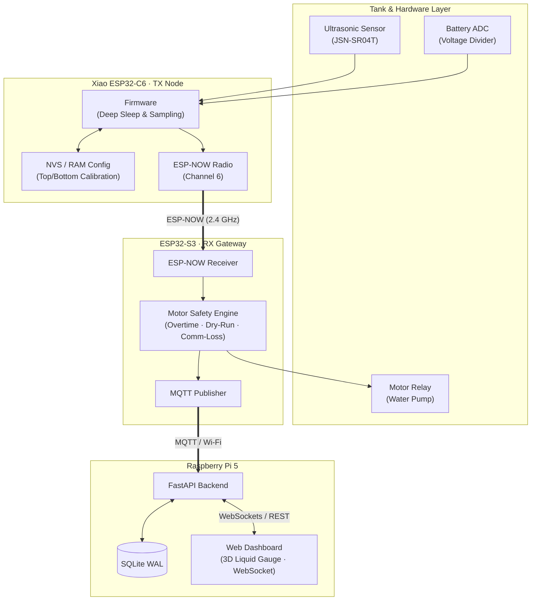
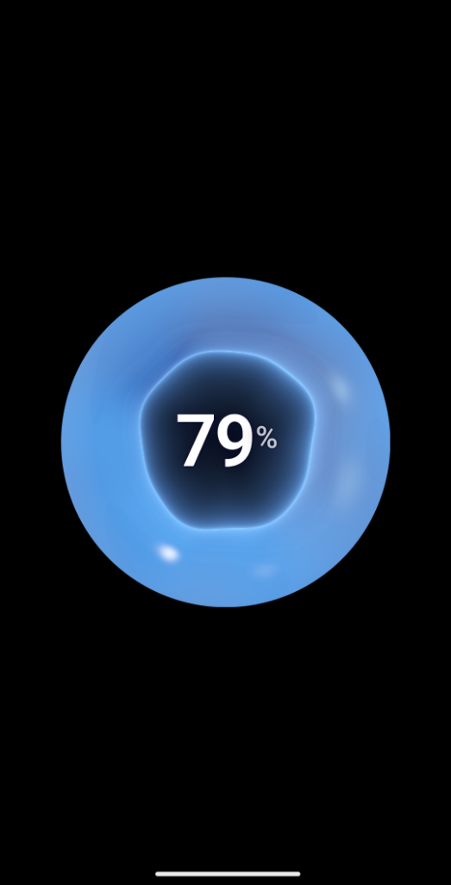
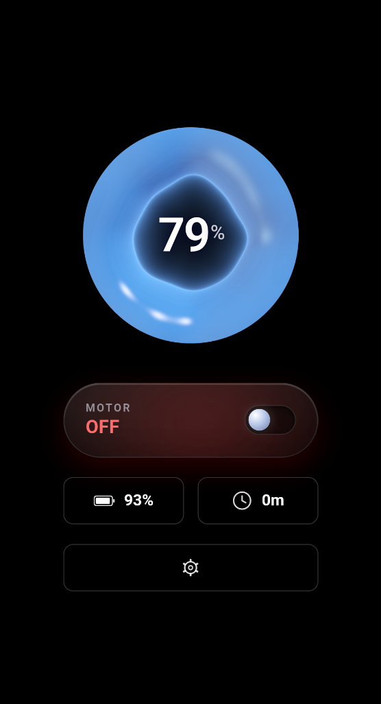
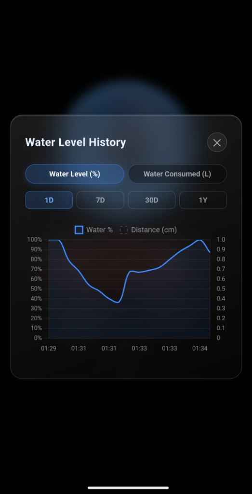
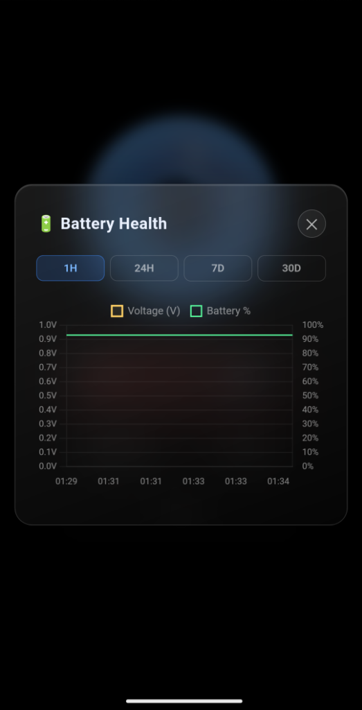
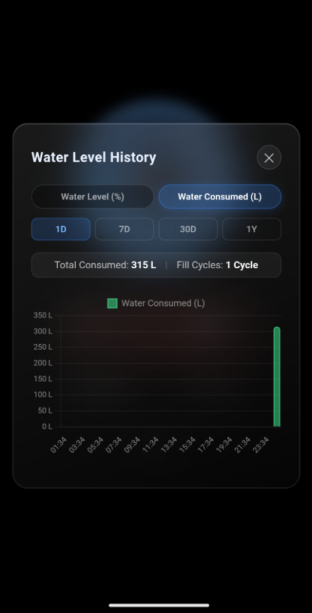
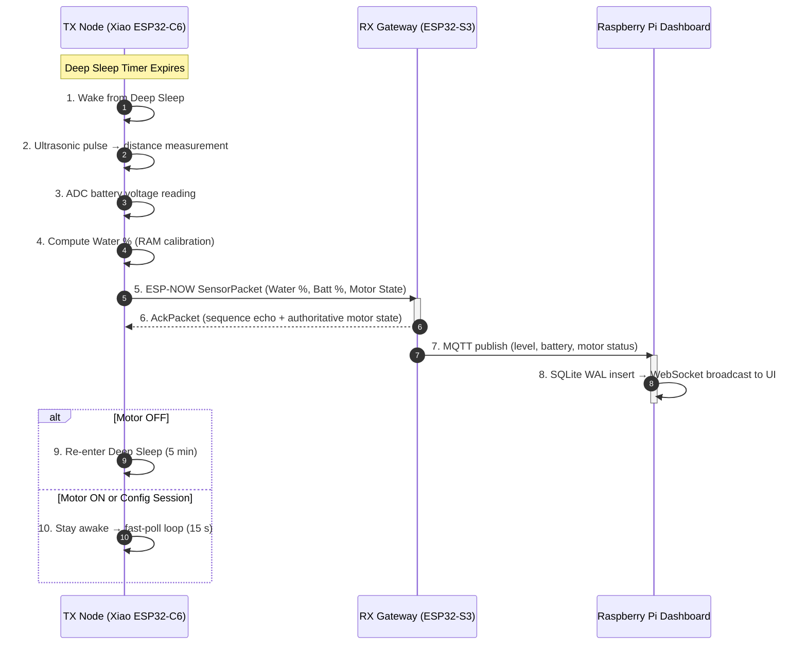
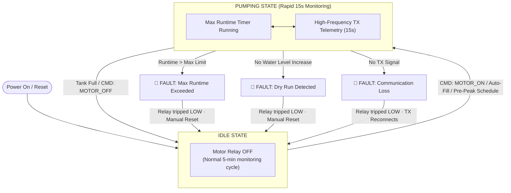
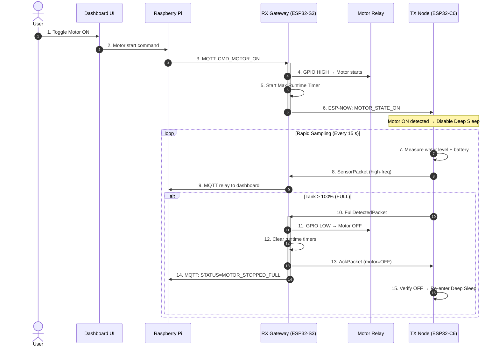
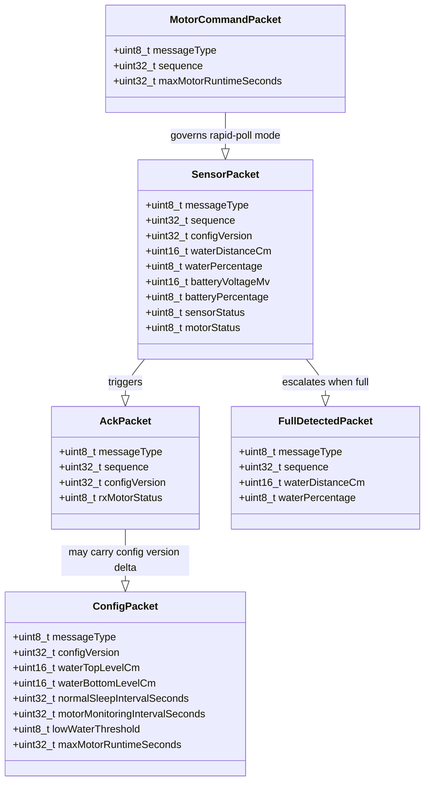

# 💧 Water Tank Monitor 

> **A production-deployed, three-layer IoT system** for real-time water tank monitoring, automated motor control, and historical consumption analytics — built on a 500 L rooftop tank.

[](Tx/)
[](Tx/protocol.h)
[](Rpi-Dashboard/backend/)
[](Rpi-Dashboard/docker-compose.yml)
[](Rpi-Dashboard/backend/database.py)
[](Rpi-Dashboard/backend/app.py)
[](Rpi-Dashboard/)

---

## Overview

Water Tank Monitor is a **fully autonomous, local-network IoT system** deployed on a real rooftop water tank. It continuously measures water level, controls the pump motor, and serves a live dashboard — all without any cloud dependency.

The system is architectured across **three hardware layers**:

| Layer | Hardware | Role |
|---|---|---|
| **TX Node** | Xiao ESP32-C6 | Solar + Battery-powered sensor node — deep sleep, ultrasonics, ESP-NOW |
| **RX Gateway** | ESP32-S3 | Mains-powered relay controller & Wi-Fi/ESP-NOW bridge |
| **Dashboard** | Raspberry Pi 5 | FastAPI backend, SQLite storage, WebSocket UI |



---

## Dashboard Screenshots

<div align="center">

| Live Gauge | Home Screen | Water History |
|:---:|:---:|:---:|
|  |  |  |

| Battery Health | Consumption Analytics |
|:---:|:---:|
|  |  |

</div>

---

## Key Features

### ⚡ Power Optimization (TX Node)

| Technique | Detail |
|---|---|
| **ESP32 Deep Sleep** | TX sleeps between readings; wakes only to sample + transmit (~2–3 s active per cycle) |
| **Adaptive Duty Cycle** | Normal: 5-min sleep interval · Motor filling: 15-s rapid-poll (no sleep) |
| **ESP-NOW over Wi-Fi** | ESP-NOW skips Wi-Fi association handshake entirely — transmit completes in ~6 ms |
| **RTC Memory Mode Persistence** | Operating mode (`NORMAL` / `MOTOR_FILLING` / `CONFIG_SESSION` / `OTA`) stored in RTC RAM, survives deep sleep resets |
| **Battery Life** | Calculated theoretical runtime: **~30 days** on a 500 mAh Li-ion at 5-min interval. Real-world deployment confirmed this estimate was accurate. |

### 🛡️ Motor Safety Engine (RX Node)

The RX gateway holds **direct GPIO control** of the relay — the motor is cut off by hardware even if the Raspberry Pi backend is down.

Three independent fault triggers:

| Fault | Condition | Action |
|---|---|---|
| **Max Runtime** | Motor on longer than configured limit | Relay tripped OFF immediately |
| **Dry Run** | No water-level increase over timeout period | Relay tripped OFF immediately |
| **Comm Loss** | No telemetry received from TX for timeout period | Relay tripped OFF immediately |

### 🗓️ Pre-Peak Fill Scheduler

The RX node runs a **NTP-synced daily schedule** (`pre_peak_fill.cpp`) that automatically triggers the pump before a configurable peak-usage window (default: 17:30 IST). Once triggered, completion is written to NVS flash — a power cut between trigger and fill does not cause a double-fill.

### 🔧 Non-Destructive Live Config Preview

Tank calibration (`WATER_TOP_LVL` / `WATER_BOTTOM_LVL`) can be tested live without writing to flash:

1. Dashboard opens a Config Session → TX stays awake (no deep sleep)
2. User edits values → clicks **Apply & Preview** → values stored in RAM only
3. TX immediately measures using preview calibration and reports live `%`
4. User clicks **Save** → values committed to NVS; or closes the page → TX discards preview and restores last saved config

This prevents NVS flash wear from speculative calibration updates.

### 📡 Bidirectional ESP-NOW Protocol

A typed binary protocol (`protocol.h`) with 18 message types and application-level ACKs:

| Packet | Purpose |
|---|---|
| `SensorPacket` | TX → RX telemetry (water %, battery, motor state, sequence) |
| `AckPacket` | RX → TX delivery confirmation + authoritative motor state |
| `ConfigPacket` | RX → TX config delivery (preview or save) |
| `MotorCommandPacket` | RX → TX motor ON/OFF with max runtime enforcement |
| `FullDetectedPacket` | TX → RX tank-full event (triggers relay OFF) |

### 🔄 Wireless OTA Firmware Updates

TX firmware can be updated over-the-air via Wi-Fi. OTA mode is entered via an ESP-NOW command from RX and persisted in RTC RAM so the TX correctly resumes OTA state after the required ESP.restart() mid-update.

---

## Normal Telemetry Cycle



---

## Motor Safety State Machine



---

## High-Frequency Filling Cycle



---

## Firmware Architecture

### TX Node — `Tx/`

```
Tx/
├── Tx.ino                # Main state machine, boot & loop orchestration
├── protocol.h            # Shared typed binary packet definitions (18 msg types)
├── motor_state.cpp       # RTC-persisted operating mode FSM
│                         #   NORMAL → MOTOR_FILLING → CONFIG_SESSION → OTA
├── espnow_tx.cpp         # ESP-NOW with sequence tracking, ACK & 10-retry logic
├── config.cpp            # NVS saved config + RAM preview separation
├── water_sensor.cpp      # JSN-SR04T ultrasonic measurement + glitch filtering
├── battery.cpp           # ADC voltage → calibrated % curve
├── sleep_manager.cpp     # Deep sleep orchestration + boot count (RTC)
├── ota_manager.cpp       # Wi-Fi OTA with RTC mode persistence across ESP.restart()
└── antenna_select.cpp    # External / internal antenna switching (Xiao ESP32-C6)
```

**Design highlights:**
- Operating mode persisted in `RTC_DATA_ATTR` — survives both deep sleep and OTA resets
- Low-water + ACK-fail triggers a 15-second short-sleep retry (max 3 attempts) before falling back to normal interval — prevents missing a low-water fill event due to a transient radio glitch
- Sensor glitch correction: measurements deviating >3× from the rolling average are flagged `SENSOR_STATUS_GLITCH_FIX` and smoothed

### RX Gateway — `Rx/`

```
Rx/
├── Rx.ino                # Main loop & telemetry routing
├── protocol.h            # Same shared protocol header as TX
├── espnow_gateway.cpp    # Bidirectional ESP-NOW gateway + per-device ACK tables
├── motor_controller.cpp  # GPIO relay control, runtime enforcement, fault logic
├── pre_peak_fill.cpp     # Configurable daily pre-fill scheduler (NVS-persisted)
├── mqtt_client.cpp       # MQTT publishing → Raspberry Pi broker
├── serial_cli.cpp        # Serial command interface for debugging & diagnostics
└── wifi_manager.cpp      # NTP-synced Wi-Fi (ESP-NOW & Wi-Fi on same channel)
```

**Design highlights:**
- ESP-NOW and Wi-Fi **coexist on the same 2.4 GHz radio**, pinned to the same channel as the home router — no radio-switching delays
- Motor relay is controlled by direct GPIO — independent of network state; Pi crash cannot leave motor running
- Pre-peak fill NVS-persists the "already done today" date as `YYYYMMDD` integer — a power cut between schedule trigger and fill will not re-trigger on next boot

---

## Dashboard — `Rpi-Dashboard/`

**Stack:** FastAPI · MQTT · SQLite (WAL) · WebSockets · Docker

### Three Pages

| Page | What it shows |
|---|---|
| **Home** | 3D animated liquid gauge · Motor toggle (live state) · Battery % · Config version · Last telemetry time |
| **Graphs** | Water level % history · Water consumed (L) · Motor runtime · Battery voltage — ranges: 1H → 1Y |
| **Config** | Live RAM-preview calibration session · Measurement interval · Motor safety thresholds · Save/Discard flow |

### Analytics

Water consumption is calculated per fill cycle:

```
Consumed (L) = ΔWater% × 500 L / 100
```

The dashboard tracks fill cycles, total daily consumption, and motor runtime across configurable time windows (1D / 7D / 30D / 1Y).

### CLI Management Tools

```bash
# View DB stats + configured tank capacity
./manage_db --status

# Change tank capacity to 500 L (live — no restart needed)
./manage_db --tank 500

# Clear last 6 hours of telemetry
./clear_data --6h

# Clear data older than 30 days
./manage_db --older-than 30d

# Skip confirmation prompt
./clear_data --6h -y
```

Inside the Docker container on Pi:
```bash
docker exec -it water-tank-dashboard ./manage_db --status
```

### Deployment

```bash
cd /home/pi/water_tank_v2/Rpi-Dashboard

# Build and start (single command)
docker compose up -d

# Access dashboard
http://<RASPBERRY_PI_IP>:8001
```

---

## Wire Protocol — Packet Schemas



All packets use `#pragma pack(push, 1)` — zero padding, exact wire size.

---

## Repository Layout

```
water_tank_v2/
├── Tx/                                  # Xiao ESP32-C6 Arduino firmware
│   ├── Tx.ino
│   ├── protocol.h                       # Shared packet definitions
│   └── *.cpp / *.h                      # Modular subsystems
│
├── Rx/                                  # ESP32-S3 Arduino firmware
│   ├── Rx.ino
│   ├── protocol.h                       # Same shared protocol
│   └── *.cpp / *.h
│
├── Rpi-Dashboard/                       # Raspberry Pi service
│   ├── backend/
│   │   ├── app.py                       # FastAPI + WebSocket server
│   │   ├── database.py                  # SQLite WAL layer + analytics queries
│   │   └── mqtt_listener.py            # MQTT → DB ingestion
│   ├── static/                          # Dashboard HTML/CSS/JS
│   ├── manage_db                        # CLI: status, capacity, purge
│   ├── clear_data                       # CLI: time-range purge shorthand
│   ├── Dockerfile
│   └── docker-compose.yml
│
├── docs/
│   └── screenshots/                     # Dashboard screenshots
│
├── visual_system_flow.md               # Full Mermaid architecture diagrams
└── water_tank_monitor_v2_architecture.md  # Complete design specification
```

---

## Quick Start

### 1. Flash TX Firmware (Xiao ESP32-C6)
Open `Tx/Tx.ino` in Arduino IDE. Set your RX MAC address and flash.

### 2. Flash RX Firmware (ESP32-S3)
Open `Rx/Rx.ino` in Arduino IDE. Set your Wi-Fi credentials and flash.

### 3. Deploy Dashboard (Raspberry Pi 5)
```bash
git clone <this-repo>
cd water_tank_v2/Rpi-Dashboard
docker compose up -d
```

Dashboard available at `http://<PI_IP>:8001`.

---

## Further Reading

- [`visual_system_flow.md`](visual_system_flow.md) — Complete Mermaid diagrams for all system flows, state machines, and config session sequences
- [`water_tank_monitor_v2_architecture.md`](water_tank_monitor_v2_architecture.md) — Full design specification and engineering decisions
- [`Rpi-Dashboard/README.md`](Rpi-Dashboard/README.md) — Dashboard-specific deployment and CLI reference
