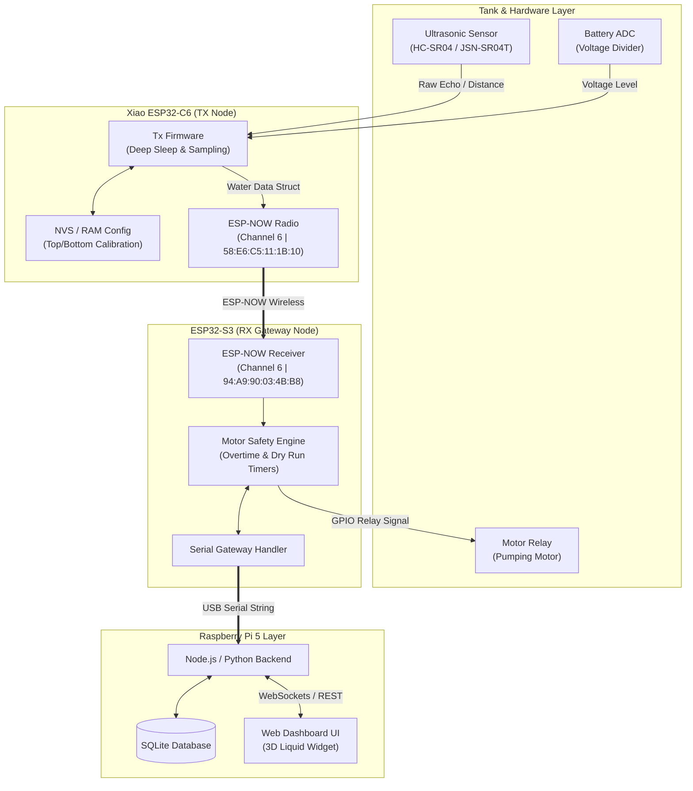
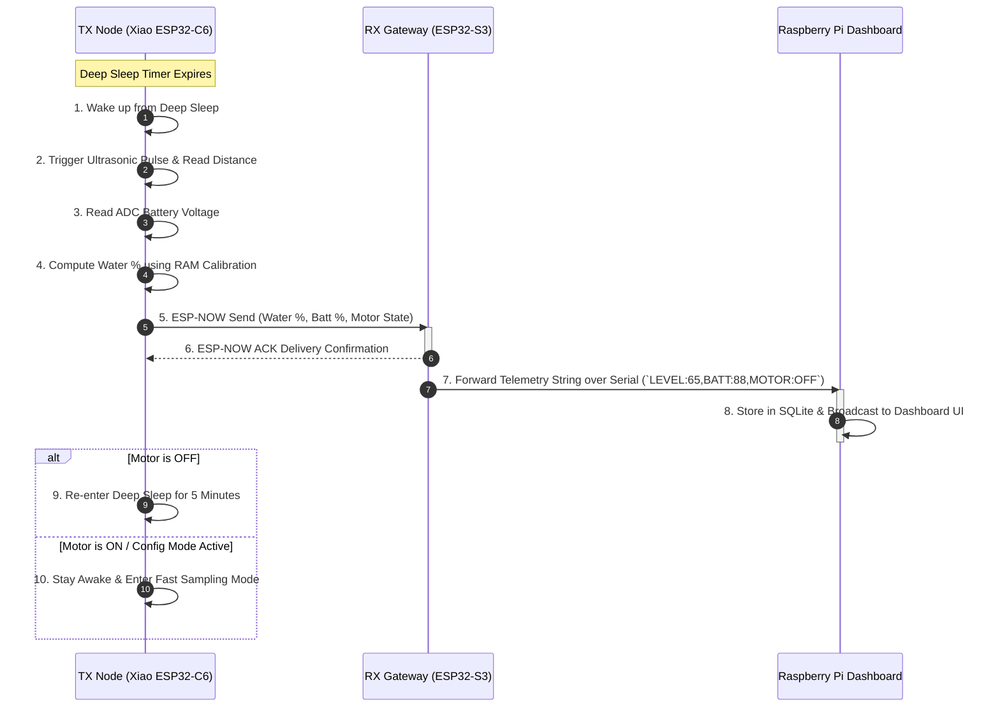
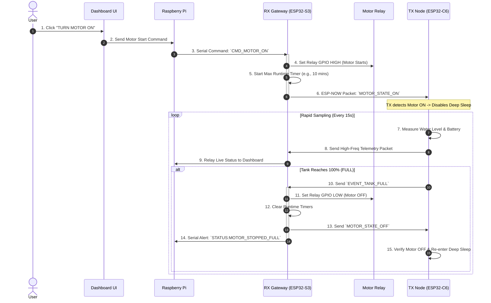
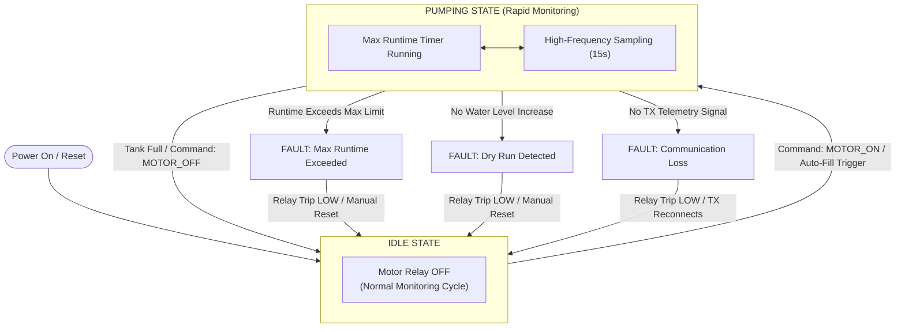
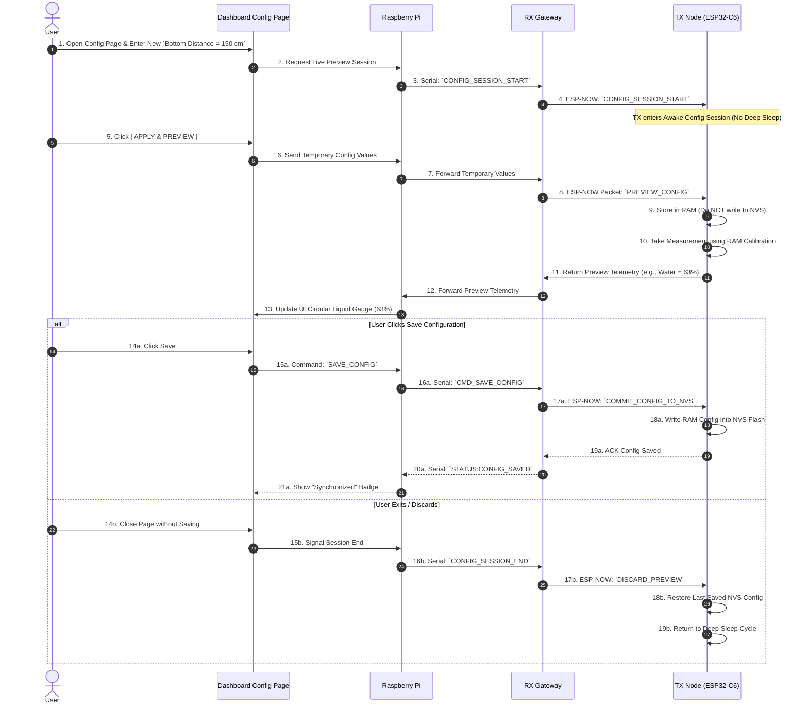
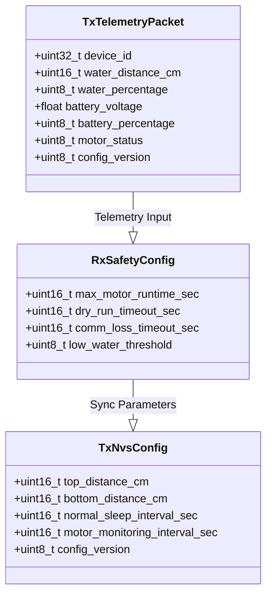

# Water Tank Monitor V2 - Visual Architecture & System Flows

> [!NOTE]
> This document visualizes the complete system architecture, hardware interactions, communication protocols, state machines, and data pipelines for the **Water Tank Monitor V2** project using Mermaid diagrams.

---

## 1. High-Level System Topology & End-to-End Data Flow

The diagram below outlines the physical device layers, communication channels, and end-to-end telemetry/control paths across the **TX Node**, **RX Gateway**, and **Raspberry Pi Dashboard**.

---

## 2. Normal Deep-Sleep Telemetry Cycle

In normal operation (when the motor is OFF), the **TX Node** sleeps to conserve solar/battery power and wakes up at the configured measurement interval (default: 5 minutes).

---

## 3. High-Frequency Motor Control & Safety Filling Cycle

When the pump motor is turned ON (via manual Dashboard toggle or low water detection), the system switches to **rapid monitoring mode** (15-second interval) to prevent overflow.

---

## 4. RX Motor Safety State Machine

The **ESP32-S3 RX Gateway** acts as the primary safety lock to prevent motor burnouts, dry runs, or tank overflows even if Wi-Fi or Pi connection drops.

---

## 5. Live Configuration Preview vs. NVS Save Flow

To adjust tank depth settings without risking persistent corruption or flash memory wear, the system supports a **RAM preview mode** before saving to NVS.

---

## 6. Summary of Key Data Payload Schemas

---

> [!TIP]
> **Key Takeaways from the Diagrams:**
> 1. **Failsafe Autonomy**: The RX node maintains direct GPIO control of the motor relay, meaning it can shut off the pump even if the Raspberry Pi backend crashes.
> 2. **Power Efficiency**: The TX node only stays fully awake during motor pumping or active configuration preview sessions.
> 3. **Non-Destructive Calibration**: `APPLY & PREVIEW` lets you calibrate your tank depth live without wearing out the ESP32 flash NVS memory.
